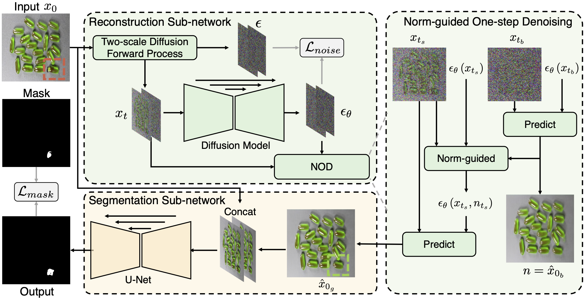

# DiffusionAD




**DiffusionAD: Norm-guided One-step Denoising Diffusion for Anomaly Detection**

*Hui Zhang, Zheng Wang, Zuxuan Wu, Yu-Gang Jiang*

[Paper link](https://arxiv.org/abs/2303.08730)

##  Introduction

This repo contains source code for **DiffusionAD** implemented with PyTorch.

DiffusionAD is a novel framework for anomaly detection and localization, which consists of a reconstruction sub-network and a segmentation sub-network. The reconstruction sub-network is implemented via a diffusion model and is tasked with recovering anomalous images to anomaly-free ones. The segmentation sub-network predicts pixel-level anomaly scores using the input image and its anomaly-free recovery. Remarkably, we adopt a one-step denoising paradigm, which is considerably faster than iterative denoising approaches. Furthermore, the proposed norm-guided paradigm enhances the fidelity of the anomaly-free reconstruction.​

## Get Started 

### Environment 
```bash
pip install -r requirements.txt
```

### Data

#### MvTec-AD
Download the dataset from [here](https://www.mvtec.com/company/research/datasets/mvtec-ad/).

#### VisA
Download the dataset from [here](https://amazon-visual-anomaly.s3.us-west-2.amazonaws.com/VisA_20220922.tar).

#### Foreground
In the anomaly synthetic strategy, we employ different foreground extraction methods for datasets belonging to different classes. For the object dataset, we use [DIS](https://github.com/xuebinqin/DIS) to extract foregrounds. For the textural dataset, we design the foreground as a random part of the entire image.​ ​​The Describable Textures dataset(DTD) is one of the anomaly source image sets and can be downloaded from [here](https://www.robots.ox.ac.uk/~vgg/data/dtd/).

Images of these foregrounds can be downloaded from [Google Drive](https://drive.google.com/drive/folders/1goH-PqWD35jvXuZNcBlR6elKf7eBx8lY?usp=drive_link).

Finally, make sure that these datasets follow the data tree.

```

MVTec-AD
|-- carpet
|-----|----- thresh
|-----|----- ground_truth
|-----|----- test
|-----|--------|------ good
|-----|--------|------ ...
|-----|----- train
|-----|--------|------ good
|-- cable
|-----|----- DISthresh
|-----|----- ground_truth
|-----|----- test
|-----|--------|------ good
|-----|--------|------ ...
|-----|----- train
|-----|--------|------ good

VisA
|-- candle
|-----|----- DISthresh
|-----|----- ground_truth
|-----|----- test
|-----|--------|------ good
|-----|--------|------ bad
|-----|----- train
|-----|--------|------ good
|-- capsules
|-- ...

```


## Train
Please specify the dataset path(MVTec-AD,VisA), anomaly_source_path(DTD), and output folder in args.json and run:
```bash
python train.py
```

## Evaluation
To perform inference with checkpoints, please run:
```bash
python eval.py
```

## Citation
```
@article{zhang2023diffusionad,
  title={DiffusionAD: Norm-guided One-step Denoising Diffusion for Anomaly Detection},
  author={Zhang, Hui and Wang, Zheng and Wu, Zuxuan and Jiang, Yu-Gang},
  journal={arXiv preprint arXiv:2303.08730},
  year={2023}
}
```

## License

All code within the repo is under [MIT license](https://mit-license.org/)
